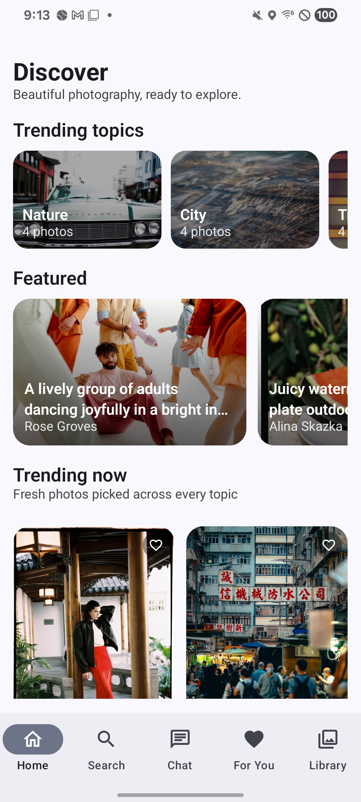
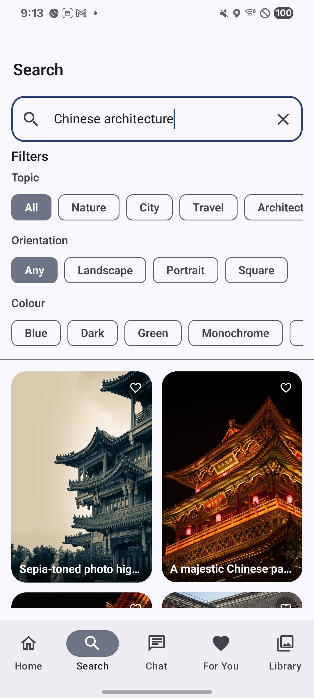
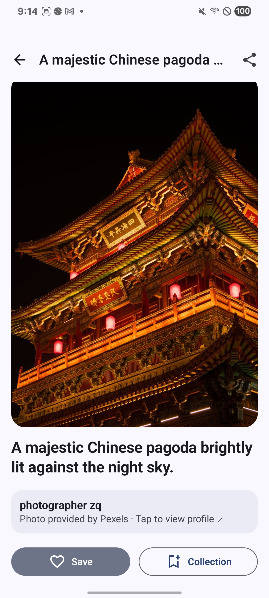
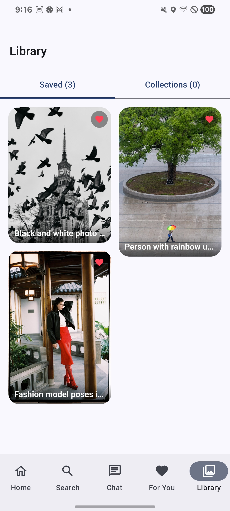
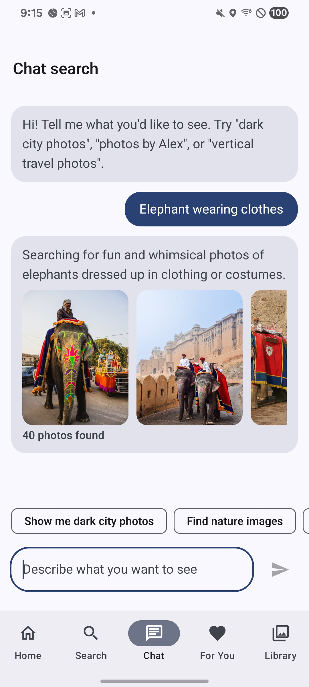
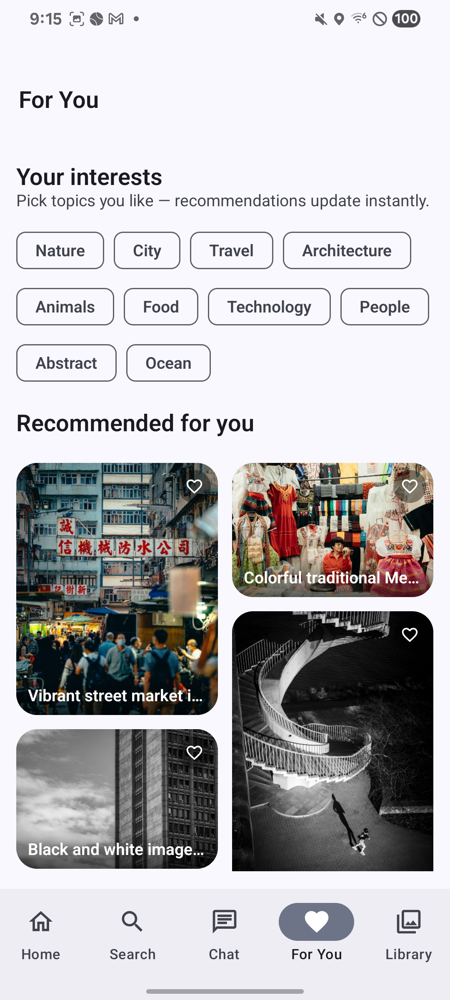
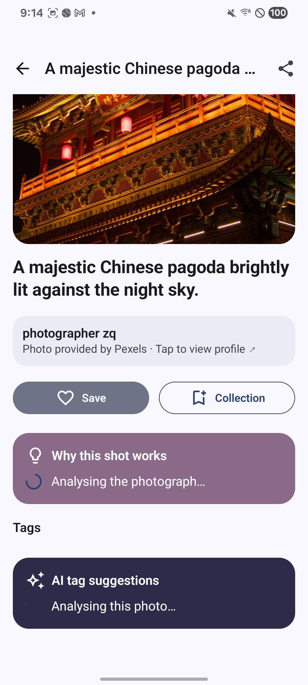
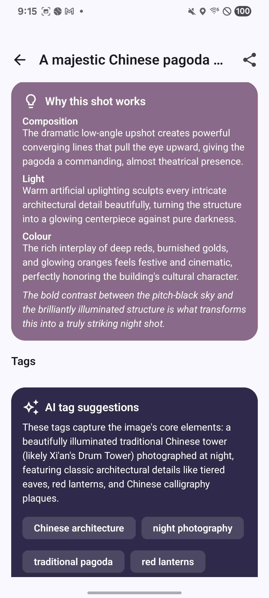

# Splashr

**A modern Android photo-discovery app — browse, search, and explore photography with AI-assisted features powered by Claude.**

Splashr pairs a clean Material 3 interface with a smart, AI-augmented discovery experience: search by natural language, get vision-based tag suggestions and photo critiques, and a personalised "For You" feed ranked by an LLM. Photos come from [Pexels](https://www.pexels.com/api/) — real photography, with proper attribution.

It runs immediately with **zero setup** — no accounts, no API keys — and unlocks more powerful features when you add a Pexels and/or Anthropic key.

---

## Screenshots

<table>
<tr>
<td align="center" valign="top" width="25%">
  <b>Home</b><br>
  <br>
  <sub>Trending topics, featured rail, fresh photos grid</sub>
</td>
<td align="center" valign="top" width="25%">
  <b>Search</b><br>
  <br>
  <sub>Query box plus topic, orientation, and colour filter chips</sub>
</td>
<td align="center" valign="top" width="25%">
  <b>Photo detail</b><br>
  <br>
  <sub>Pexels photo with attribution and save / collection actions</sub>
</td>
<td align="center" valign="top" width="25%">
  <b>Library</b><br>
  <br>
  <sub>Saved photos shown with the red 'liked' heart</sub>
</td>
</tr>
<tr>
<td align="center" valign="top" width="25%">
  <b>Chat search</b><br>
  <br>
  <sub>Claude turns a plain-English query into a real search</sub>
</td>
<td align="center" valign="top" width="25%">
  <b>For You</b><br>
  <br>
  <sub>Claude-ranked feed based on your saved photos and chosen interests</sub>
</td>
<td align="center" valign="top" width="25%">
  <b>AI analysing</b><br>
  <br>
  <sub>Both AI cards in their loading state while Claude analyses the photo</sub>
</td>
<td align="center" valign="top" width="25%">
  <b>"Why this shot works"</b><br>
  <br>
  <sub>AI in action — critique (composition / light / colour) plus generated tags</sub>
</td>
</tr>
</table>

---

## Features

| Area | What it does |
|------|--------------|
| **Home / Discover** | Trending topics, a featured rail, and a masonry grid of fresh photos. |
| **Search** | Free-text search with topic, orientation, and colour filters. |
| **Chat search** | Type a request in plain English ("dark moody city shots at night") and Claude turns it into a real search. |
| **For You** | A personalised feed Claude ranks from your saved photos and chosen interests. |
| **Photo detail** | Full-screen photo with pinch-to-zoom, share, and photographer attribution. |
| **AI tag suggestions** | Claude *looks at* the photo and suggests discovery tags with a one-line explanation. |
| **"Why this shot works"** | A mentor-style critique of composition, light, colour, and the photo's strongest element. |
| **Save / offline** | Save any photo — metadata is stored locally and stays browsable offline. |
| **Collections** | Create collections, add/remove photos, rename, delete. |
| **Photographer profiles** | Curated bios, locations, and full portfolios (sample data only). |

---

## How the AI works

The app uses **Anthropic's Claude API** for four user-facing features, all behind a single [`AiSuggestionService`](app/src/main/java/ai/chaski/splashr/ai/AiSuggestionService.kt) interface. Claude has powered the AI features since the project's first iteration; this build runs on `claude-sonnet-4-6`.

### 1. Photo tag suggestions

**Where:** photo detail screen → "Suggest tags" card.

Tap the button and Claude looks at the actual image, generates 5–6 short discovery tags, and writes a one-sentence explanation of why they fit. Useful for finding tags that go beyond the obvious — a photo of a quiet morning street might surface tags like *"liminal"*, *"empty space"*, *"early light"* rather than just *"city"*. Each photo is sent to the model at most once; subsequent visits load the cached result instantly.

### 2. "Why this shot works" critique

**Where:** photo detail screen → critique card.

A short, mentor-style breakdown of the photograph in four sections:

- **Composition** — how the frame is built (subject placement, lines, balance)
- **Light** — quality and direction
- **Colour** — palette and what it contributes
- **Takeaway** — the single thing that makes this shot strongest

Same caching as tag suggestions — analyse once, instant on every revisit.

### 3. Chat search

**Where:** Chat tab → natural-language text input.

Type a request in plain English and Claude turns it into a structured search filter, then runs it against Pexels. It also writes back a friendly interpretation so you can see what it understood.

Examples:
- *"dark moody city shots at night"* → topic = City, colour = dark
- *"vertical travel photos by Alex"* → orientation = Portrait, topic = Travel, photographer = Alex
- *"calm green nature, wide"* → topic = Nature, colour = green, orientation = Landscape

### 4. "For You" recommendations

**Where:** For You tab → personalised feed.

Pick a few topic interests, save photos you like, and Claude ranks the available photo pool against both signals — surfacing photos most likely to interest you, best matches first. The feed re-ranks whenever you change interests or save something new.

---

### Design notes

All four features sit behind one [`AiSuggestionService`](app/src/main/java/ai/chaski/splashr/ai/AiSuggestionService.kt) interface with two implementations:

- **`ClaudeAiService`** — the Anthropic-backed implementation. Every call is wrapped in a `runCatching` block; on any failure (missing key, network error, malformed response) it silently falls back to:
- **`RuleBasedAiService`** — a fully-offline alternative using keyword matching and scoring. No network, no key, deterministic.

[`AppContainer`](app/src/main/java/ai/chaski/splashr/di/AppContainer.kt) picks the active implementation at startup based on whether `BuildConfig.ANTHROPIC_API_KEY` is set. The app is **fully functional with no API key at all** — features just become smarter when one is present.

### What the AI can't do

- **Generate images.** Claude reads images; it doesn't create them. For invented imagery you'd need a different kind of model entirely.
- **Find photos that don't exist on Pexels.** The catalogue is real photography — the AI can only rank and interpret what's actually there.

---

## Tech stack

- **Kotlin** + **Jetpack Compose** (Material 3, dynamic colour, dark theme)
- **MVVM** with `ViewModel` + `StateFlow`
- **Room** for offline storage — saved photos, collections, AI cache
- **Retrofit** + **Gson** for the Pexels and Anthropic APIs
- **Coil** for image loading with crossfade plus loading/error states
- **Coroutines** / **Flow** throughout
- **Navigation Compose** for a single-Activity app
- Material 3 components only — no third-party design libraries

---

## Architecture

```
ai.chaski.splashr
├── data
│   ├── model           Domain models (Photo, Photographer, Collection, AiTagSuggestion, PhotoCritique, …)
│   ├── local           Room database, DAOs, entities (saved photos, collections, AI cache)
│   ├── remote          Retrofit clients + DTOs (PexelsApi, AnthropicApi)
│   ├── sample          Built-in SampleData catalogue (active when no Pexels key is set)
│   └── repository      PhotoRepository interface + FakePhotoRepository + PexelsPhotoRepository
├── ai                  AiSuggestionService interface + RuleBasedAiService + ClaudeAiService
├── di                  AppContainer — wires repositories and services from BuildConfig keys
└── ui
    ├── theme           Material 3 theme
    ├── navigation      Routes + bottom-navigation scaffold
    ├── components      Reusable composables (image, grid, photo card, …)
    └── home / search / chat / detail / collections / photographer / foryou
```

### Two seams that make the app modular

Two interfaces define the swap points:

- **`PhotoRepository`** — `FakePhotoRepository` (Room + `SampleData`) and `PexelsPhotoRepository` (Retrofit + Pexels). The Pexels implementation uses **Kotlin interface delegation** (`by library`) so it inherits all of the saved-photo and collection logic from the fake repository and only overrides the catalogue methods. No duplication.
- **`AiSuggestionService`** — `RuleBasedAiService` (offline, deterministic) and `ClaudeAiService` (Anthropic + Room cache). Same shape, different intelligence.

`AppContainer` reads `BuildConfig.PEXELS_API_KEY` and `BuildConfig.ANTHROPIC_API_KEY` at startup and picks the active pair. Swapping providers later — say, Unsplash instead of Pexels, or a different LLM instead of Claude — is a one-line change.

---

## Getting started

**Requirements**

- Android Studio (Ladybug / 2024.2 or newer)
- JDK 17
- Android SDK 35 · minimum device API 26 (Android 8.0)

### Run with zero setup

1. Open the project folder in Android Studio.
2. Let Gradle sync.
3. Pick an emulator or device and press **Run**.

The app launches into the bundled `SampleData` catalogue with `RuleBasedAiService`. No keys, no accounts, no network roundtrips beyond loading sample images.

### Optional: unlock real photos + Claude AI

Create a `secrets.properties` file in the project root (template at [`secrets.properties.example`](secrets.properties.example)):

```properties
# Free at https://www.pexels.com/api/
pexelsApiKey=YOUR_KEY

# https://console.anthropic.com/  — used for the AI features only
anthropicApiKey=YOUR_KEY
```

Sync Gradle. `BuildConfig` will pick up the keys and the app will switch to:

- **Real Pexels photos** in the Home grids and Search results
- **Claude Sonnet 4.6** for tag suggestions, the photo critique, chat search, and "For You" ranking

Either key is optional. Configure neither and you get the offline experience. Configure both and you get the full one. Configure just one (e.g. Pexels but no Anthropic) and you get real photos with rule-based AI — also fine.

> `secrets.properties` is git-ignored. Your keys never leave your machine.

> **Security note:** because this is a portfolio build, the Anthropic key is read into `BuildConfig` and ends up inside the compiled APK. That's acceptable for a local demo — **don't distribute the APK publicly**. For a deployed app you'd put the key behind a backend proxy.

---

## Tests

A small JVM unit-test suite covers the rule-based AI service (chat-search parser, tag suggester, recommendation ranking):

```
./gradlew test
```

---

## About

Splashr was my final project for an Android mobile development course in 2025 — and my first time playing around with AI in a product.

---

## License

The Splashr source code is released under the [MIT License](LICENSE) — © 2026 Alexander Picon.

Photos shown in the running app come from [Pexels](https://www.pexels.com) and remain under the [Pexels License](https://www.pexels.com/license/) (free to use, attribution appreciated — the app credits each photographer on its detail screen).
